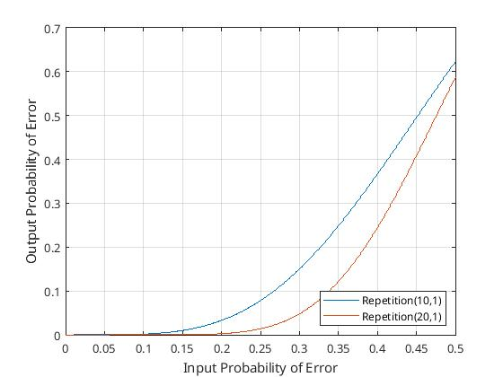
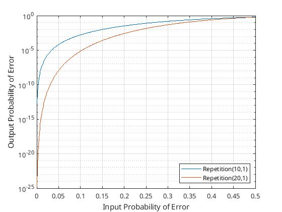

# Eye Blink Detection

### Source Encoding Model

  - At present, we are using 10 bits to encode the data bit. Thus, we can think of this as a Repetition(10, 1) scheme. 
  - We also are using all 16 combinations of the 4 bit input data sequence (40 bit encoded sequence). Thus, the input data has a *minimum hamming distance* of **1**
  - If we combine this fact along with our encoding scheme, the *effective minimum hamming distance* is **10**
        
    
  - Thus, this encoding scheme can correct upto 4 bits. 
  - Similarly, if we increase the minimum hamming distance of the input data to **2** by considering only 4 out of the 16 4 bit schemes, the *minimum effective hamming distance* is now **20**, and this can correct upto **9** bits.

### Probability of error of transmission

- The probability of error of transmission is estimated by taking trials against the ground truth blink sequence `10101010101010101010`. 
- Each bit of the ground truth sequence has a corresponding 10 bit of sensor data. So the ground truth blink sequence corresponds to a 100-bit binary sequence `111111111100000000001111111111...`
- This sequence was chosen as the ground truth because this sequence capture the transition of the bits from `0 to 1` and `1 to 0`.
- Multiple trials of sequences are conducted against the ground truth blink sequence.
- The probability of transmission error was calculated as the hamming distance between the recorded sequence and the ground truth sequence.
- It was observed that the probability of transmission error ranged from 0.1 to 0.4 for various trials. The mean probability comes out to be 0.28

### Theoretical Evaluation 

  - The probability of error for an encoding scheme can be theoretically calculated with the help of the number of bits that can be corrected. 

=\sum_{j=n/2}^{n}{\binom{n}{j}p^j(1-p)^{n-j}})

*Input vs Output probability of error*

*Log plot for the same*

        
